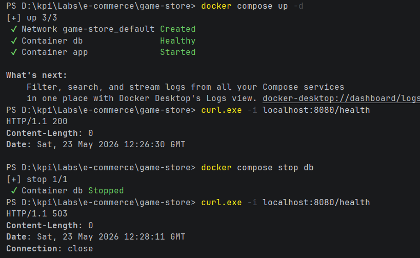
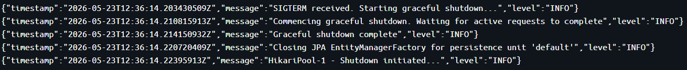

# Java e-commerce. Game key store

## Overview

This project is a Spring Boot based e-commerce REST API for managing games by genres.

- Spring Boot
- PostgreSQL
- Liquibase
- Docker Compose
- Testcontainers
- MapStruct
- Structured JSON logging

---

## Environment Variables

Application configuration is loaded from a local `.env` file.

Example for required variables in `.env`:
```env
DB_HOST=localhost
DB_PORT=5432
DB_NAME=gamestore
DB_USER=postgres
DB_PASSWORD=postgres
```

---

## Running the Application

### 1. Clone the repository
```bash
git clone https://github.com/YevhenKaskov/java-gamestore.git
cd java-gamestore
```

### 2. Create `.env`
Create a `.env` file in the project root and fill in database settings.

### 3. Start containers
```bash
docker compose up --build
```

The application will be available at:
- API: `http://localhost:8080`
- PostgreSQL: `localhost:5432`

---

## Health Check


---

## JSON Log Example
```json
{"timestamp":"2026-05-23T12:39:39.422774981Z","message":"HikariPool-1 - Start completed.","level":"INFO"}
{"timestamp":"2026-05-23T12:39:40.711245163Z","message":"ChangeSet db/liquibase/changes/001-init-schema.yaml::003-add-game-genre-fk::yevhen ran successfully in 8ms","level":"INFO"}
{"timestamp":"2026-05-23T12:39:43.362946587Z","message":"Tomcat started on port 8080 (http) with context path '/'","level":"INFO"}
{"timestamp":"2026-05-23T12:39:43.372929604Z","message":"Started GameStoreApplication in 6.846 seconds (process running for 7.486)","level":"INFO"}
```

---

## Graceful Shutdown
```bash
docker compose stop
```



---

## Running Tests
```bash
./gradlew build
```